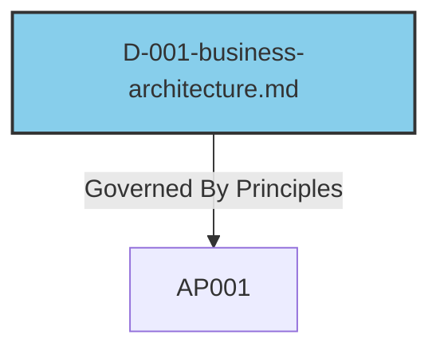

# EA CLI Tool Documentation

## Overview

The **EA CLI Tool** (`ea_cli.py`) is a comprehensive command-line interface for managing Enterprise Architecture (EA) artifacts. It provides structured management of architectural principles, rules, domains, and verifications with automated linking, validation, and visualization capabilities.

## Core Concepts

### Artifact Types

The tool manages four primary artifact types:

| Artifact Type | Directory | Prefix | Purpose |
|---------------|-----------|--------|---------|
| **Principle** | `principles/` | `AP` | High-level architectural guidance |
| **Rule** | `rules/` | `AR` | Specific implementation requirements |
| **Domain** | `domains/` | `D` | Architectural domains (Business, Data, Application, Technology) |
| **Verification** | `verifications/` | `V` | Gherkin-based compliance tests |

### Relationship Model

The tool enforces a structured relationship model between artifacts:

```
Principles ←→ Rules ←→ Verifications
    ↕
Domains ←→ Verifications
```

**Valid Relationships:**
- **Principles** can be `supported_by_rules` and `verified_by` verifications
- **Rules** can `supports_principles` and be `verified_by` verifications  
- **Domains** can be `governed_by_principles` and `verified_by` verifications

### File Structure

```
ea-repository/
├── principles/
│   ├── spec.yaml
│   ├── AP-001-simplicity.md
│   └── AP-002-uniformity.md
├── rules/
│   ├── spec.yaml
│   ├── AR-001-reproducible.md
│   └── AR-002-modular.md
├── domains/
│   ├── spec.yaml
│   ├── D-001-business-architecture.md
│   └── D-002-data-architecture.md
├── verifications/
│   ├── spec.yaml
│   └── V-001-encryption-compliance.md
├── gherkin/                    # Extracted feature files
│   ├── encryption-compliance.gherkin
│   └── data-retention.gherkin
└── gherkin-implements/         # Implementation files
    ├── security-steps.gherkin
    └── compliance-steps.gherkin
```

## Key Features

### 1. Repository Management

#### Initialize Repository
```bash
ea-mgr init [directory]
```
Creates a fully populated sample repository with:
- 7 sample principles (Simplicity, Uniformity, Agility, etc.)
- 7 sample rules (Reproducible, Modular, Manageable, etc.)
- 4 TOGAF domains (Business, Data, Application, Technology)
- Pre-configured relationships between artifacts

#### Extract Gherkin Features
```bash
ea-mgr --extract-gherkin
```
Extracts all Gherkin feature blocks from verification files into a separate `gherkin/` directory for BDD testing frameworks.

### 2. Artifact CRUD Operations

#### Create New Artifacts
```bash
ea-mgr create <type> "<title>" [--moscow <priority>]
```
- Generates standardized filenames (e.g., `AP-003-new-principle.md`)
- Applies templates from `spec.yaml` configuration
- Sets MoSCoW priority (Must, Should, Could, Won't)
- Initializes relationship fields

#### List Artifacts
```bash
ea-mgr list <type>
```
Displays table view with:
- MoSCoW priority
- Outgoing link counts
- Incoming link counts (reverse linkage analysis)
- Filename

#### Show Artifact Details
```bash
ea-mgr show <type> <filename>
```
Displays:
- Complete metadata from `spec.yaml`
- Full markdown content
- All relationships

#### Update Metadata
```bash
ea-mgr update <path> [--moscow <new-priority>]
```
Modifies artifact metadata while preserving relationships.

#### Delete Artifacts
```bash
ea-mgr delete <path> [--force]
```
Removes artifact file and metadata with optional confirmation.

### 3. Relationship Management

#### Link Artifacts
```bash
ea-mgr link <source-path> <target-path>
```
Creates relationships based on the predefined relationship map:
- Validates relationship types
- Prevents invalid linkages
- Updates `spec.yaml` automatically

Example:
```bash
ea-mgr link principles/AP-001-simplicity.md rules/AR-002-modular.md
# Creates "supported_by_rules" relationship
```

#### Unlink Artifacts
```bash
ea-mgr unlink <source-path> <target-path>
```
Removes specific relationships while preserving other links.

### 4. Visualization

#### Generate Relationship Diagrams
```bash
ea-mgr visualize [artifact-path] [--type <type>] [--format <format>] [--depth <levels>]
```

**Options:**
- `--type domain|principle|rule|verification|all` - Visualize all artifacts of a type
- `--format mermaid|markdown` - Output format
- `--depth N` - Relationship traversal depth

**Mermaid Output:**


**Markdown Output:**
```markdown
* **Domain:** [D-001-business-architecture.md](domains/D-001-business-architecture.md)
    * *Governed By Principles:*
        * **Principle:** [AP-001-simplicity.md](principles/AP-001-simplicity.md)
```

### 5. Validation & Compliance

#### Comprehensive Validation
```bash
ea-mgr validate all
```

**Validation Checks:**
1. **File Synchronization**: Ensures `spec.yaml` matches disk files
2. **Metadata Integrity**: Validates MoSCoW values and required fields
3. **Link Validation**: Verifies all relationships point to existing files
4. **Content Validation**: Applies custom regex rules from `spec.yaml`

**Example Content Validation Rule:**
```yaml
__config__:
  validation_rules:
    purpose_exists:
      description: "The '## Purpose' section must contain at least one bullet point."
      pattern: '## Purpose\n\n- .+'
```

### 6. Gherkin Test Execution (Cucumber Replacement)

The EA CLI integrates with **`gherkin-runner.py`**, a lightweight Python-based Gherkin test runner that **replaces traditional Cucumber** setups. This eliminates the need for Ruby/Java environments and provides a more streamlined testing experience.

#### Why Replace Cucumber?

**Traditional Cucumber Problems:**
- Complex setup requiring Ruby/Java runtime environments
- Dependency management issues across different platforms
- Heavyweight framework for simple compliance checks
- Difficult integration with shell-based infrastructure tools

**Gherkin-Runner Advantages:**
- **Zero Dependencies**: Only requires Python and bash (available everywhere)
- **Cross-Platform**: Handles Windows/Linux/macOS automatically
- **Shell-Native**: Uses bash scripts for step implementations
- **Lightweight**: Minimal overhead, fast execution
- **Git-Friendly**: Simple text-based implementation files

#### Running Gherkin Tests

```bash
# Extract Gherkin features from verifications
ea-mgr --extract-gherkin

# Run specific feature file
python gherkin-runner.py gherkin/encryption-compliance.gherkin

# Run with debug output
python gherkin-runner.py gherkin/data-retention.gherkin --debug

# Output results as JSON for CI/CD integration
python gherkin-runner.py gherkin/security-audit.gherkin --json
```

#### Implementation File Format

Step implementations are stored in `.gherkin` files using the `IMPLEMENTS` pattern:

```bash
# File: gherkin-implements/security-steps.gherkin

IMPLEMENTS Given a system stores PII data
#!/bin/bash
echo "Checking for PII data storage..."
# Check if encryption is enabled
if grep -q "encryption=true" /etc/app/config.ini; then
    echo "PII encryption is enabled"
    export PII_ENCRYPTED="true"
else
    echo "ERROR: PII encryption not found" >&2
    exit 1
fi

IMPLEMENTS When data is written to the database
#!/bin/bash
echo "Simulating database write operation..."
# Simulate database operation
if [ "$PII_ENCRYPTED" = "true" ]; then
    echo "Writing encrypted data to database"
    export DATABASE_WRITE_STATUS="encrypted"
else
    echo "ERROR: Cannot write unencrypted PII data" >&2
    exit 1
fi

IMPLEMENTS Then the data must be encrypted at rest
#!/bin/bash
echo "Verifying encryption at rest..."
if [ "$DATABASE_WRITE_STATUS" = "encrypted" ]; then
    echo "✓ Data is properly encrypted at rest"
else
    echo "ERROR: Data encryption at rest not verified" >&2
    exit 1
fi
```

#### Variable Passing and Context

The runner automatically handles variable passing between steps:

- **Environment Variables**: All variables are passed via environment
- **Regex Captures**: Pattern matches become `$MATCH_1`, `$MATCH_2`, etc.
- **Previous Output**: `$PREVIOUS_STEP_STDOUT` contains previous step output
- **Cross-Platform**: Handles Windows/Unix path and line ending differences

#### Regex Pattern Matching

Implementations support regex patterns for flexible step matching:

```bash
IMPLEMENTS Given a system with (\d+) users
#!/bin/bash
USER_COUNT=$MATCH_1
echo "Testing system with $USER_COUNT users"
# Test implementation here

IMPLEMENTS When I create a new (.*) record
#!/bin/bash
RECORD_TYPE=$MATCH_1
echo "Creating new $RECORD_TYPE record"
# Implementation logic
```

#### Integration with CI/CD

```bash
# Complete testing workflow
set -e

# Validate EA repository structure
ea-mgr validate all

# Extract latest Gherkin features
ea-mgr --extract-gherkin

# Run all compliance tests
for feature in gherkin/*.gherkin; do
    echo "Running $feature..."
    python gherkin-runner.py "$feature" --json > "results/$(basename $feature .gherkin).json"
done

# Generate compliance report
python generate-compliance-report.py results/
```

#### Cross-Platform Bash Detection

The runner automatically finds appropriate bash executables:

- **Linux/macOS**: Uses system bash
- **Windows**: Automatically detects Git Bash, avoiding WSL issues
- **Fallback**: Searches common installation paths
- **Error Handling**: Clear guidance when bash is not found

#### Output Formats

**Human-Readable Output:**
```
Feature: Data Encryption Compliance

  Scenario: PII data storage
    ✓ Given a system stores PII data
    ✓ When data is written to the database  
    ✓ Then the data must be encrypted at rest

Run Summary:
  Scenarios: 1 total, 1 passed, 0 failed
  Steps:     3 total, 3 passed, 0 failed, 0 skipped, 0 undefined
```

**JSON Output for Automation:**
```json
{
  "feature": {
    "name": "Data Encryption Compliance",
    "file": "gherkin/encryption-compliance.gherkin"
  },
  "scenarios": [
    {
      "name": "PII data storage",
      "status": "passed",
      "steps": [
        {
          "keyword": "Given",
          "text": "a system stores PII data",
          "status": "passed"
        }
      ]
    }
  ],
  "summary": {
    "scenarios": {"total": 1, "passed": 1, "failed": 0},
    "steps": {"total": 3, "passed": 3, "failed": 0, "skipped": 0, "undefined": 0}
  }
}
```

### 7. Template System

Artifacts can be created using custom templates defined in `spec.yaml`:

```yaml
__config__:
  template: |
    # {prefix}: {title}
    
    ## Purpose
    - {description}

    ## Scope
    - <...>

    ## Stakeholders
    - <...>
```

### 8. Automated Features

#### Intelligent Filename Generation
- Auto-incrementing IDs (e.g., `AP-001`, `AP-002`)
- URL-friendly slugs from titles
- Consistent naming across artifact types

#### Reverse Link Analysis
The tool builds comprehensive linkage maps to show:
- Which artifacts depend on others
- Orphaned artifacts
- Relationship density

#### MoSCoW Priority Management
Enforces standard MoSCoW prioritization (Must, Should, Could, Won't) with validation.

## Advanced Capabilities

### 1. Business-Driven Configuration

The tool is designed to reflect real EA practices:
- **TOGAF-aligned domains** (Business, Data, Application, Technology)
- **Industry-standard principles** (Simplicity, Agility, Efficiency)
- **Operational rules** (Reproducible, Scalable, Secure)

### 2. Compliance Testing Integration

Verification artifacts support Gherkin syntax for BDD testing:

```gherkin
Feature: Encryption Compliance
  As a security architect
  I want to ensure all PII data is encrypted
  So that we meet GDPR requirements

  Scenario: PII data storage
    Given a system stores personal information
    When data is written to persistent storage
    Then the data must be encrypted at rest
```

### 3. Extensible Architecture

**Adding New Artifact Types:**
```python
ARTIFACT_CONFIG = {
    "standard": {"dir": "standards", "prefix": "AS"},  # New type
    # ... existing types
}

RELATIONSHIP_MAP = {
    "standard": {
        "implements_principles": "principle",
        "verified_by": "verification"
    }
}
```

### 4. Cross-Platform Compatibility

- UTF-8 encoding throughout
- Forward slash path separators
- Windows/Linux/macOS support

## Integration Patterns

### CI/CD Pipeline Integration
```bash
# Validate repository before merge
ea-mgr validate all

# Extract Gherkin for testing
ea-mgr --extract-gherkin

# Run compliance tests (replaces cucumber)
for feature in gherkin/*.gherkin; do
    python gherkin-runner.py "$feature" --json > "results/$(basename $feature).json"
done

# Generate documentation
ea-mgr visualize --type all --format markdown > architecture-map.md
```

### Git Workflow Integration
```bash
# Create new principle
ea-mgr create principle "Data Minimization"

# Link to supporting rule
ea-mgr link principles/AP-008-data-minimization.md rules/AR-007-retention-limits.md

# Validate before commit
ea-mgr validate all
git add . && git commit -m "Add data minimization principle"
```

### Documentation Generation
```bash
# Generate complete architecture visualization
ea-mgr visualize --type all --format mermaid > docs/architecture.mmd

# Create domain-specific views
ea-mgr visualize --type domain --format markdown > docs/domains.md
```

## Error Handling & Validation

The tool provides comprehensive error reporting:

- **File System Errors**: Missing files, permission issues
- **Validation Errors**: Invalid relationships, broken links
- **Content Errors**: Missing required sections, invalid formats
- **Configuration Errors**: Invalid MoSCoW values, malformed YAML

**Example Error Output:**
```
[ERROR] Broken link: 'AP-001-simplicity.md' points to non-existent file 'rules/AR-999-missing.md'.
[ERROR] Content error in 'D-001-business.md': The '## Purpose' section must contain at least one bullet point.
[ERROR] Invalid spec: 'AP-002-uniformity.md' has a missing or invalid MoSCoW value.
```

## Best Practices

### 1. Repository Organization
- Run `ea-mgr init` to establish standard structure
- Use meaningful, descriptive titles for artifacts
- Maintain consistent MoSCoW prioritization

### 2. Relationship Management
- Link principles to supporting rules
- Connect domains to governing principles
- Create verifications for critical requirements

### 3. Validation Workflow
- Run `ea-mgr validate all` before commits
- Use content validation rules for quality assurance
- Maintain synchronized `spec.yaml` files

### 4. Compliance Testing
- Use `gherkin-runner.py` instead of traditional Cucumber
- Write shell-based step implementations for infrastructure validation
- Integrate Gherkin tests into CI/CD pipelines for continuous compliance

### 5. Documentation Maintenance
- Generate visualizations for stakeholder communication
- Extract Gherkin features for compliance testing
- Use templates to ensure consistent artifact structure

The EA CLI Tool transforms Enterprise Architecture from static documentation into a living, validated, and interconnected system that supports modern DevOps and Architecture-as-Code practices. The integrated Gherkin runner eliminates the complexity of traditional BDD frameworks while maintaining the power of executable specifications for compliance validation.